# Salesforce DX Project: Next Steps

Now that you’ve created a Salesforce DX project, what’s next? Here are some documentation resources to get you started.

## How Do You Plan to Deploy Your Changes?

Do you want to deploy a set of changes, or create a self-contained application? Choose a [development model](https://developer.salesforce.com/tools/vscode/en/user-guide/development-models).

## Configure Your Salesforce DX Project

The `sfdx-project.json` file contains useful configuration information for your project. See [Salesforce DX Project Configuration](https://developer.salesforce.com/docs/atlas.en-us.sfdx_dev.meta/sfdx_dev/sfdx_dev_ws_config.htm) in the _Salesforce DX Developer Guide_ for details about this file.

## Read All About It

<<<<<<< HEAD
Webhook2Flow is the inverse of Salesforce External Services.  Using Webhook2flow, external Services integrate declaratively (no coding!) with your Salesforce instances to perform a variety of business actions or computations.  Webhook2Flow allows you to let Other systems integrate with your Salesforce services using existing or created webhooks in those External Systems/Services.

| **External Services** | **Webhook2Flow Services** |
| --- | --- |
|  |  |

Webhook2Flow facilitates exposing a service (as a RESTful service using JSON) entirely through flows.  To create this service declaratively (no coding!) you:

1. Define the request interface with Flow Variables
  a. Request parameters are defined by marking variables as &quot;Available for Input&quot;
  b. Response parameters are defined by marking variables as &quot;Available for Output&quot;
2. Use Flow logic and elements to service the request and build any needed response
3. Provide detailed and supportive Error conditions and helpful diagnostic error messages (if needed)
4. Provide webhooks through standard types of Service REST Resources(requests):
  a. HTTP Delete
  b. HTTP Get
  c. HTTP Patch
  d. **HTTP Post** (by far the most common and widely used)
  e. HTTP Put

## How Does This Work (The Basics)

When a system event occurs (examples; add a record, perform a query, update a record, a logic or time state change), by using a webhook, that system can make a request of another system using a standard webhook interface.  This utility allows your Salesforce system to service the requests of external systems directly in Flows without having to go through the hassle of setting up the &quot;webhook service request&quot; (at least on the salesforce side).  It does so by making your flow the service handler.

For this example, let&#39;s use GitLab - primarily because Gitlab (a DevOps Tool) by necessity MUST integrate with many other systems - both Cloud services and custom systems.  They&#39;ve had the foresight to provide a mechanism for notifying external systems, requesting actions of external systems for just about every event the platform supports.  Perhaps more importantly they&#39;ve done a great job of simplistically documenting each webhook for each event.  Specifically, let&#39;s use what happens if a user is created on GitLab -[the &quot;User created&quot; system hook](https://docs.gitlab.com/ee/system_hooks/system_hooks.html).

### Create the Saleforce request Interface

Using Flow Builder, define the information you wish to exchange through this webhook.  This can include both input and output information, though in this example we&#39;ll only be using input parameters.  The Gitlab system hook  &quot;User created&quot; which HTTP POSTs the following information:

**JSON Request**

{

&quot;created\_at&quot;: &quot;2012-07-21T07:44:07Z&quot;,

&quot;updated\_at&quot;: &quot;2012-07-21T07:38:22Z&quot;,

&quot;email&quot;: &quot;js@gitlabhq.com&quot;,

&quot;event\_name&quot;: &quot;user\_create&quot;,

&quot;name&quot;: &quot;John Smith&quot;,

&quot;username&quot;: &quot;js&quot;,

&quot;user\_id&quot;: 41

}

Create a variable with each of the names on the left with the appropriate Data Type - and mark each of them &quot;Available for Input&quot;.  Example: created\_at Data Type Date, user\_id Data Type Integer , etc.

Since in this example there is nothing we are returning to this webhook (other than the automatic acknowledgement we received the message) there is no need to designate &quot;Available for Output&quot;.  However, if you did, it would return those fields in the response.

### Use the Information in the Flow

The input fields will be populated from the request.  Use those variables as you would in any flow to fulfill the request  For example, in this instance, you may want to create or update a contact or user on Salesforce when one is created on Gitlab.

## Connect the Webhook - Address

There are two parts to this - one which we will not go into here, but it is important you understand - Authentication and Authorization.  We&#39;ll assume you have this problem licked and your &quot;client&quot; application can access this address.

The second part is easy.  Once you&#39;ve installed (and granted appropriate access via connected app or other OATH 2.0 (example: Password Credentialling), the URL is constructructed of 4 components:

https://**[YourOrg]**.my.salesforce.com/services/apexrest/**Webhook2Flow**/**[your\_flow\_API\_Name]**?parameter1=this+param+value&amp;parameter2=that+param2+value. . . 

1. **[YourOrg] - Of course, you have to know how to get to your instance**
2. **Webhook2Flow - This is how you are accessing the utility. It is the defined &quot;@RestResource&quot; Url Mapping that invokes the utility.**
3. **[your\_flow\_API\_Name] - This is the API name of your flow you wish to execute when the Webhook comes calling.**
4. **[parameters] = e.g., parameter1=this+param+value&amp;parameter2=that+param2+value....  NOTE:  YOU SHOULDN&#39;T USE THESE UNLESS YOU HAVE TO!!!  We know that some existing webhooks use parameters to define the URI, so they are supported.  Body parameters will ALWAYS override URL parameters.  This doesn&#39;t mean you should use them, unless you have to.  URL parameters are not only insecure (the URL is passed open/unencrypted across the internet), they are also subject to man-in-the-middle attacks.**

The accessing webhook can use this exact same URL for every HTTP request type (e.g., DELETE, GET, PATCH, **POST** , PUSH).  The most commonly used is POST, but this supports them all.  For the taxonomy-oriented developers, you can have a single &quot;category&quot; for all of these (eg. [default\_flow\_APIName]).  If you support multiple request types for this function, this utility will automatically look for existing flows of the appended request type (e.g., default\_flow\_APIName\_delete, default\_flow\_APIName\_get, default\_flow\_APIName\_patch, . . .), or you could specify each type specifically through the URL with different names.

NOTE:   If you have granted access to NOTE:   If you have granted access to https://**[YourOrg]**.my.salesforce.com/services/apexrest/ **Webhook2Flow** and specify a non-existant or inaccessible flow (/**[your\_flow\_API\_Name]**), the API will always return 200 (success) without doing anything, or even telling you that your Flow is not accessible.  This is a calculated security decision.

## About Authentication and Authorization

It is well beyond the scope of this implementation guide to explore the various mechanisms allowed/required in Salesforce for authentication and authorization of services.  In the hated words of our college textbooks, It is &quot;an exercise left for the reader&quot;.  If you are unfamiliar with it, [Enable OAuth Settings for API Integration](https://help.salesforce.com/articleView?id=sf.connected_app_create_api_integration.htm) and [Authorization Through Connected Apps and OAuth 2.0](https://developer.salesforce.com/docs/atlas.en-us.api_rest.meta/api_rest/intro_oauth_and_connected_apps.htm) might be a good place to start.

However, for developers, a quick way to start is to use any of the OpenAPI support tools (e.g., Postman) and create an OATH 2.0 Password Credential and use that to authenticate for development.

## Implementation Example

In this example, we will use a very basic POST service provided by GitLab as defined above.  This flow will take the information sent by the system hook &quot;User created&quot; via an HTTP POST on the event of a user creation in Gitlab, and using flow logic create a new Contact from it.

### Development Tips for this Example:

1. Develop and test the flow first.  Information about how the flow failed is difficult to find
2. For debugging purposes, you may want to make the Parameter Variables both Input and Output.  If you make them output, the information in them will appear in the body of the HTTP Response
3. &quot;name&quot; is not usable in person objects (Contact, Lead, User, . . ).  The assignments need to be to FirstName, LastName - so you&#39;ll have to parse &quot;name&quot;
4. If you actually want to set the created and last modified dates for the contact, you will need to Settings→User Interface→User Interface Enable &quot;Set Audit Fields upon Record Creation&quot; and &quot;Update Records with Inactive Owners&quot; User Permissions and in the profile(s) check &quot;Set Audit Fields upon Record Creation&quot;
5. If you are testing multiple times with the same information, you will get duplicates - either enable or delete between tests

## Example - Step by Step

1. Create an Autolaunched Flow with the API Name &quot;Test\_Webhook2Flow&quot;
 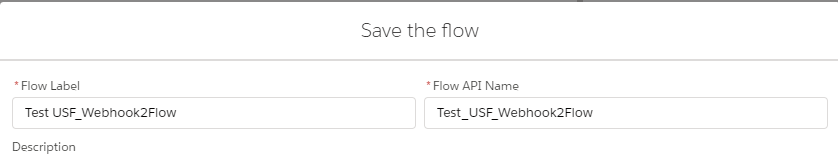
2. Add the Input Parameters specified in the above
 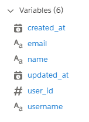
  a. created\_at
 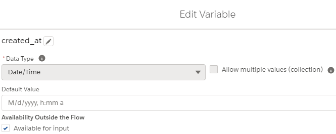
  b. updated\_at
 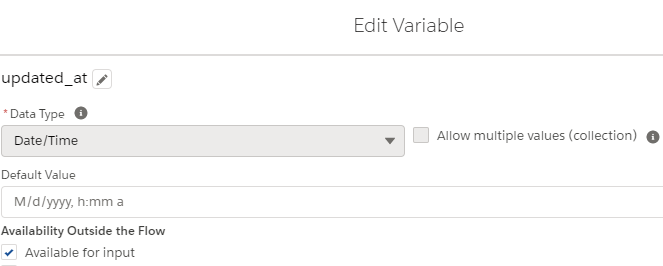
  c. email
 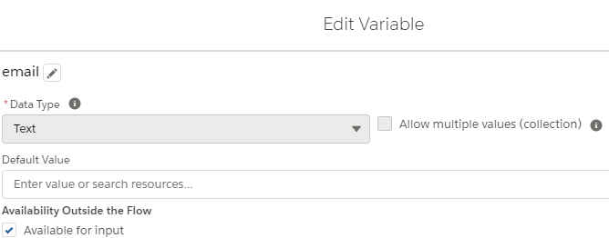
  d. event\_name (not needed, so not used)
  e. name
 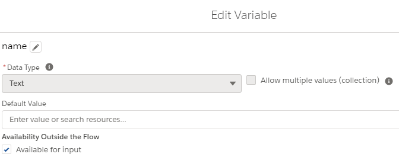
  f. username
 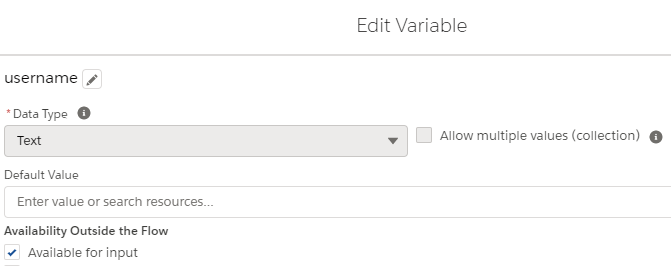
  g. user\_id
 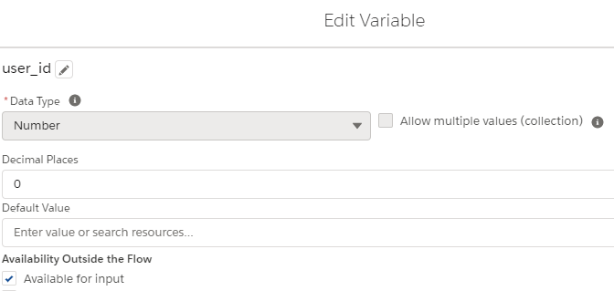
3. Add the logic needed to the flow to adequately process this request
  a. Do assignments
 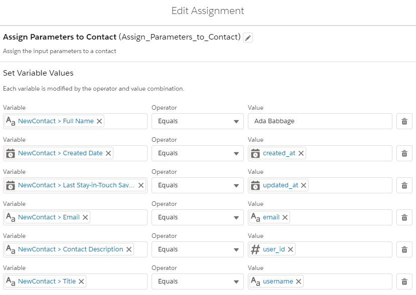
  b. Complete required flow logic
 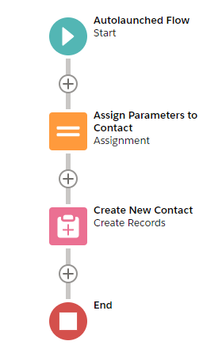
4. Test the flow - if it doesn&#39;t work in debug, it won&#39;t work in production either
5. Activate the flow (cannot run flows that are not active)
 
6. Test, Test, Test
  a. From your [SOAP And REST API Testing Tool](https://www.softwaretestinghelp.com/api-testing-tools/) (Note to get the body feedback of the stored contact, the record (NewContact) had checked &quot;Available for output&quot;
 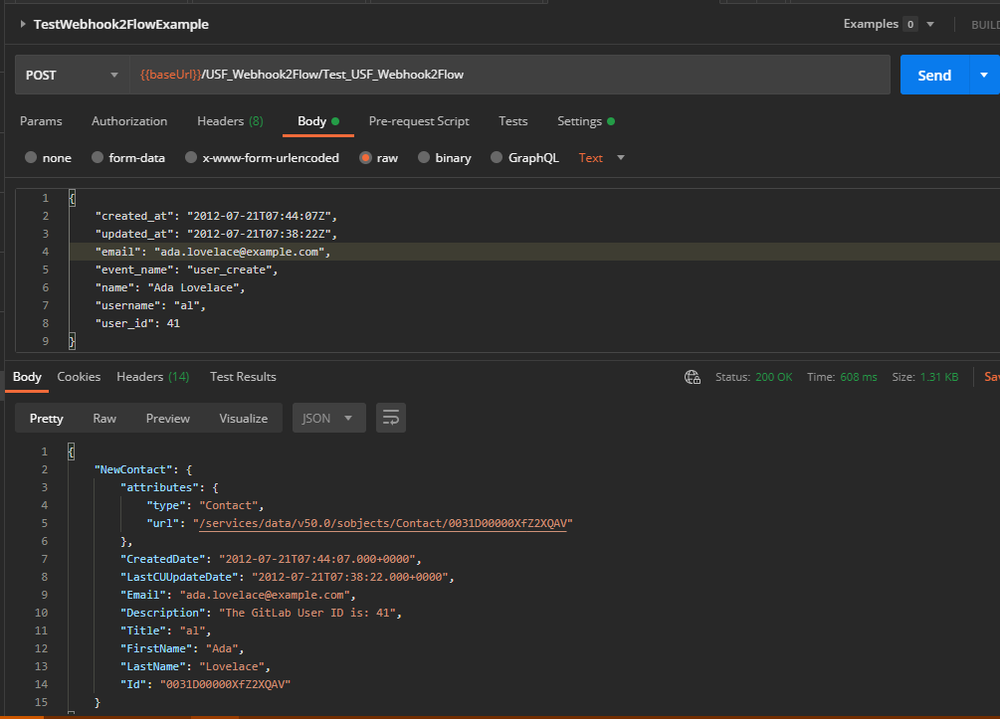
  b. Results in Salesforce
 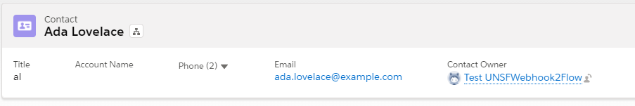
7. Some additional (cheat sheet) used in this example:
  a. Assignments
 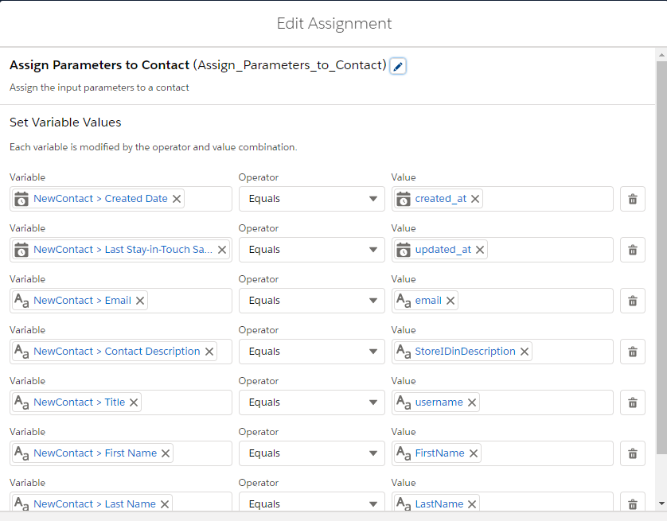
  b. Formulas used
    i. **FirstName**

IF(((Find(&quot; &quot;, {!name})-1) != -1), LEFT({!name},(Find(&quot; &quot;, {!name})-1)),&quot;&quot;)

    ii. **LastName** -

TRIM(RIGHT({!name},LEN({!name})-LEN({!FirstName})))

    iii.   **StoreIDinDescription** (actually a Text Template)

The GitLab User ID is: {!user\_id}

## Advanced Technical Information and Capabilities

### DataType Capabilities and Restrictions

1. Available
  a. Collections (including collections of objects)
  b. sObject (including custom objects)
  c. String
  d. Number
  e. Integer
  f. Boolean
  g. DateTime
  h. Date
2. **NOT Available (Yet)**
  a. Null as string (problem with JSON parser)
  b. non sObjects, including Apex-Defined
  c. Blob

### Specifying the HTTP Response StatusCode

By default, Webhook2Flow returns a StatusCode of 200 if successful, or 400 if not.  You can override this using a custom parameter (DataType Number)   **_Webhook2Flow\_RestResponse\_statusCode_** (and making it &quot;Available for output&quot;) from your flow,   If defined in the flow and null, it will use the defaults.  If set, it will be used as the response.statusCode.  The status code you return should be one acceptable to the webhook, but you can check [here](https://httpstatuses.com/) for a list of common usage.

**Exceptions and Error Processing**

OK, if you are one of those extraordinarily rare developers who provides meaningful errorsand error messages - even if those users are on different systems (yes, both of you, you know who you are), you can return this information from your flow.  This is done by creating a collection of FlowExecutionErrorEvent objects (and making it &quot;Available for output&quot;) and adding each error you wish to return.  If the collection has no members, it is assumed no error occurred.

#### Flow Error Example

In this example, adding a record caused an error.  This error is returned in the body of the response.

Steps:

1. Create a FlowExecutionErrorEvent record collection and make that collection &quot;Available for output&quot;.  In this example it was named _errorCollection_
2. Create a FlowExecutionErrorEvent record variable to be used in assignments
3. Introduce Flow logic that detects the error condition (in this example a fault condition from a record insert)
4. Define the error (two fields in the FlowExecutionErrorEvent record variable- ErrorMessage and ErrorId)
5. Add the defined FlowExecutionErrorEvent record variable to the FlowExecutionErrorEvent record collection
6. TEST

If you&#39;re looking for an ErrorId to return, you may want to look at those already defined in your instance at: [https://[yourinstance].my.salesforce.com/services/wsdl/tooling](https://inspiration-power-78282-dev-ed.cs68.my.salesforce.com/services/wsdl/tooling) under \&lt;xsd:simpleType name=&quot;StatusCode&quot;\&gt;.

## References

- [Enabling Webhooks to Launch Flows](https://quip.com/VoMrASkiH7PO/Enabling-Webhooks-to-Launch-Flows)
- [Connected Apps](https://developer.salesforce.com/docs/atlas.en-us.securityImplGuide.meta/securityImplGuide/connected_apps.htm)
- [Connected App Use Cases](https://help.salesforce.com/articleView?id=connected_app_about.htm&amp;language=en_US)
- [Create a Connected App](https://help.salesforce.com/articleView?id=connected_app_create.htm&amp;language=en_US)
-  [Identity Basics Trailhead Module](https://trailhead.salesforce.com/content/learn/modules/identity_basics)
- [Connected AppBasics](https://trailhead.salesforce.com/en/content/learn/modules/connected-app-basics)
- [Build a Connected App for API Integration](https://trailhead.salesforce.com/content/learn/projects/build-a-connected-app-for-api-integration)
- [OAUTH 2.0 Authentication](https://swagger.io/docs/specification/authentication/oauth2/)
- [OAuth 2.0 Web Server Flow for Web App Integration](https://help.salesforce.com/articleView?id=sf.remoteaccess_oauth_web_server_flow.htm&amp;type=5)
- [Create a Connected App for Your Dev Hub Org](https://developer.salesforce.com/docs/atlas.en-us.sfdx_dev.meta/sfdx_dev/sfdx_dev_auth_connected_app.htm)
<<<<<<< HEAD
=======
- [Salesforce Extensions Documentation](https://developer.salesforce.com/tools/vscode/)
- [Salesforce CLI Setup Guide](https://developer.salesforce.com/docs/atlas.en-us.sfdx_setup.meta/sfdx_setup/sfdx_setup_intro.htm)
- [Salesforce DX Developer Guide](https://developer.salesforce.com/docs/atlas.en-us.sfdx_dev.meta/sfdx_dev/sfdx_dev_intro.htm)
- [Salesforce CLI Command Reference](https://developer.salesforce.com/docs/atlas.en-us.sfdx_cli_reference.meta/sfdx_cli_reference/cli_reference.htm)
>>>>>>> init sfdx
=======
>>>>>>> b5e77aa645368b456621ed2696fbd59f4bca82ab
